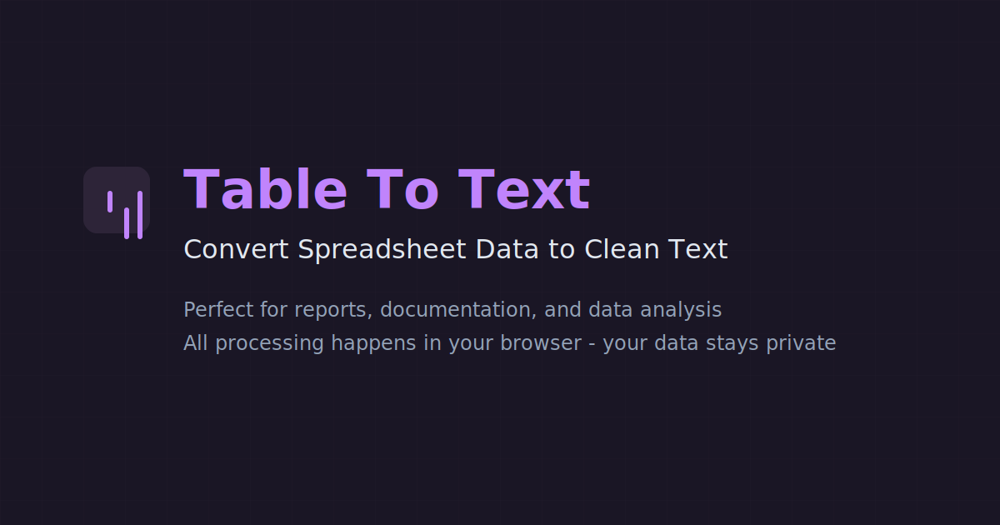

# Table To Text Converter

[](https://nextjs.org/)
[](https://www.typescriptlang.org/)
[](https://tailwindcss.com/)
[](https://opensource.org/licenses/MIT)

> **Convert spreadsheet data to clean, readable text format instantly.** Perfect for reports, documentation, and data analysis. All processing happens in your browser - your data stays private.



## ✨ Features

- 🔄 **Instant Conversion** - Real-time conversion as you paste
- 📊 **Multi-Format Support** - Excel, Google Sheets, CSV, TSV
- 🔒 **Privacy-First** - All processing happens in your browser
- 📋 **Copy & Clear** - One-click copy to clipboard
- 🎨 **Modern UI** - Beautiful dark theme with textured backgrounds
- � **Responsive Design** - Works perfectly on desktop and mobile
## 🚀 Live Demo

Visit the live application: [https://tabletotext.com](https://tabletotext.com)

## 🛠️ Tech Stack

- **Framework**: [Next.js 15](https://nextjs.org/) with App Router
- **Language**: [TypeScript](https://www.typescriptlang.org/)
- **Styling**: [TailwindCSS v4](https://tailwindcss.com/)
- **UI Components**: [ShadCN UI](https://ui.shadcn.com/)
- **Icons**: [Lucide React](https://lucide.dev/)
- **Fonts**: [Inter](https://fonts.google.com/specimen/Inter) from Google Fonts

## 🎯 Usage

1. **Copy data** from Excel, Google Sheets, or any spreadsheet
2. **Paste into the converter** - conversion happens automatically
3. **Copy the result** - clean, formatted text ready to use
4. **Use in reports** - perfect for documentation and analysis

### Example

**Input (from spreadsheet):**
```
Name	Age	City
John	25	New York
Jane	30	Los Angeles
```

**Output (converted text):**
```
Name | Age | City
John | 25 | New York
Jane | 30 | Los Angeles
```

## 🏗️ Project Structure

```
src/
├── app/                    # Next.js App Router
│   ├── globals.css        # Global styles and theme
│   ├── layout.tsx         # Root layout with metadata
│   └── page.tsx           # Main application page
├── components/            # React components
│   ├── ui/               # ShadCN UI components
│   ├── SimpleConverter.tsx  # Main converter component
│   └── TableToTextLogo.tsx # Custom logo component
├── lib/                   # Utility functions
│   ├── metadata.ts        # SEO and social metadata
│   ├── structured-data.ts # Schema.org structured data
│   ├── table-utils.ts     # Table parsing and formatting
│   └── utils.ts           # General utilities
public/                    # Static assets
├── favicon.svg           # Site favicon
├── apple-touch-icon.svg  # Apple device icon
├── og-image.svg          # Social sharing image
└── site.webmanifest      # PWA manifest
```

## 🔧 Development

### Available Scripts

```bash
npm run dev          # Start development server
npm run build        # Build for production
npm run start        # Start production server
npm run lint         # Run ESLint
npm run type-check   # Run TypeScript checks
```

## 🚀 Deployment

### Vercel (Recommended)

1. Push your code to GitHub
2. Connect your repository to [Vercel](https://vercel.com)
3. Deploy automatically on every push

## 🤝 Contributing

Contributions are welcome! Please feel free to submit a Pull Request.

1. Fork the repository
2. Create your feature branch (`git checkout -b feature/AmazingFeature`)
3. Commit your changes (`git commit -m 'Add some AmazingFeature'`)
4. Push to the branch (`git push origin feature/AmazingFeature`)
5. Open a Pull Request

## 📝 License

This project is licensed under the MIT License.

## 🙏 Acknowledgments

- [ShadCN](https://ui.shadcn.com/) for the excellent UI component library
- [Lucide](https://lucide.dev/) for the beautiful icons
- [Vercel](https://vercel.com/) for the amazing hosting platform

## 📞 Support

If you like this tool, consider supporting its development:

[](https://ko-fi.com/mikecloudlaunch)

---

**Built with ❤️ by [Cloud Launch](https://cloudlaunch.au)**

This project is licensed under the ISC License.

## Acknowledgments

- Built with [Next.js](https://nextjs.org/)
- Styled with [TailwindCSS](https://tailwindcss.com/)
- UI components from [ShadCN UI](https://ui.shadcn.com/)
- Icons from [Lucide React](https://lucide.dev/)
